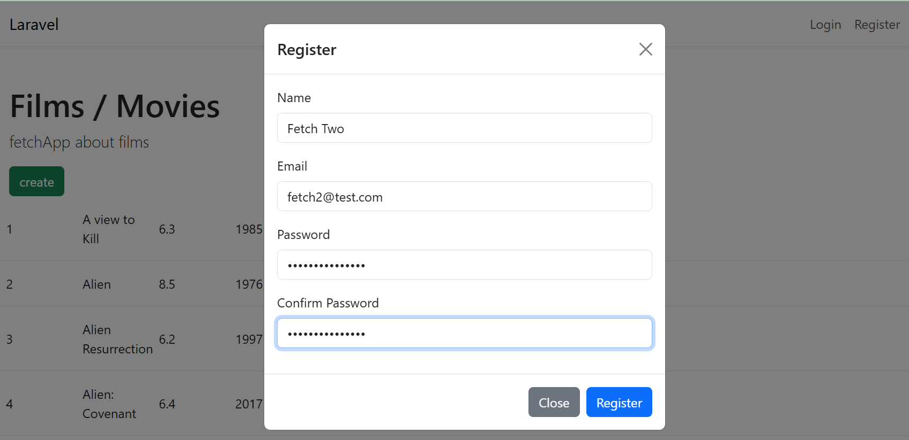
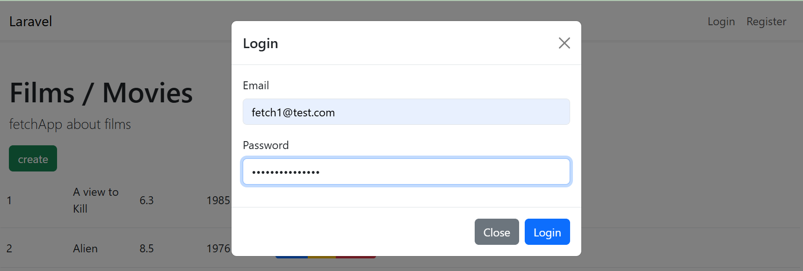
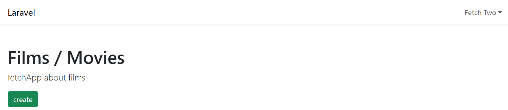
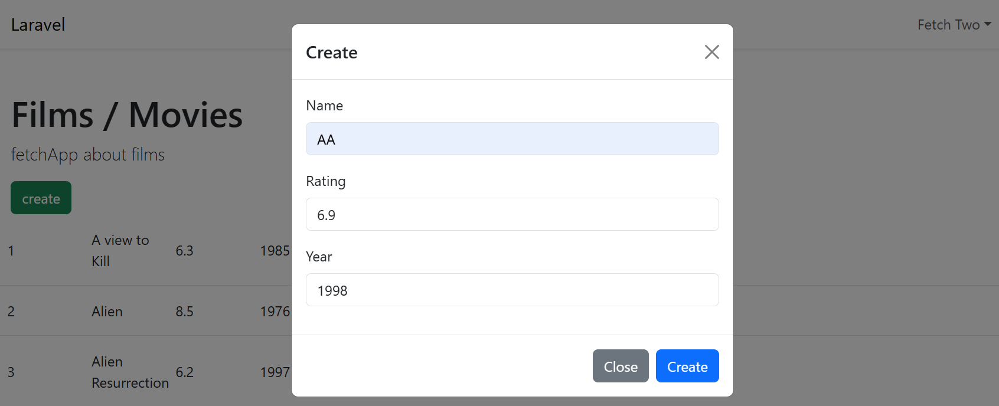
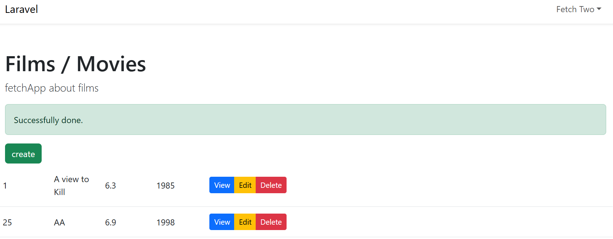
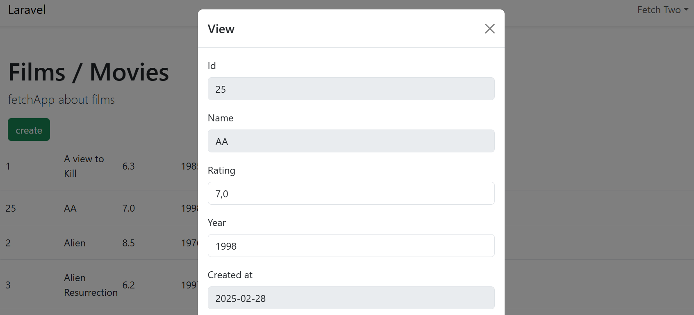
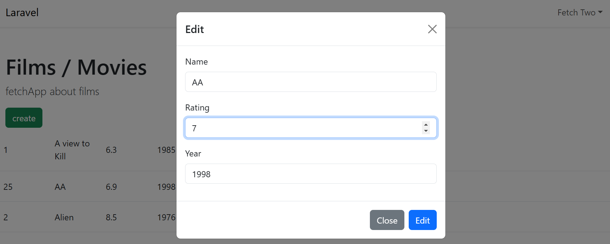
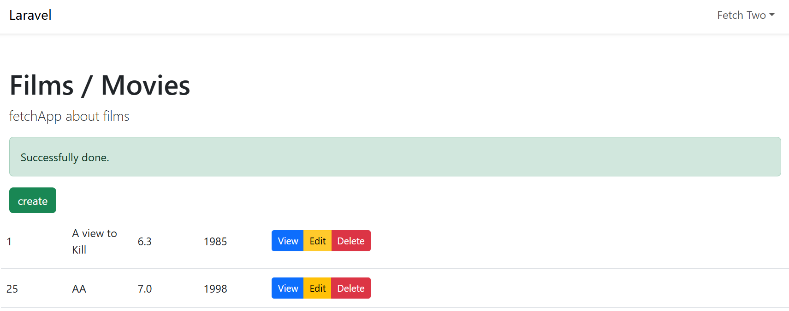
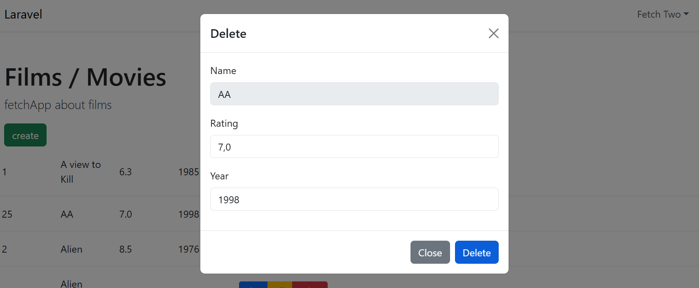
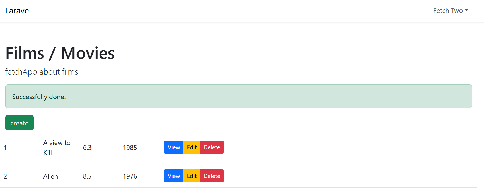

# Fetch App

## Register
To fill in with a username, email and password (which has to be repeated for security reasons).

## Login
Asks for email and password.

## Logged in
Username appears on top right of nav instead of the Login or Regiter options.

## Creation of a Film
A pop-up window appears with the fields that need a value for the film to be created.

1.  Fill it in
2.  Click the create button

A success message appears once created and the new film appears in the list.

## Viewing of a film
A pop-up window appears with all of the film's attributes.

## Edition of a film
A pop-up window appears with the fields that can be edited (same ones as in the creation)

1.  Edit whatever is necessary
2.  Click the edit button

A success message appears once edited and the film appears modified in the list.

## Deletion of a film
A pop-up window appears with the same fields as in the creation/edition.

1.  Make sure that it is the film you want to delete
2.  Click the delete button

A success message appears once edited and the film is no longer in the list.
